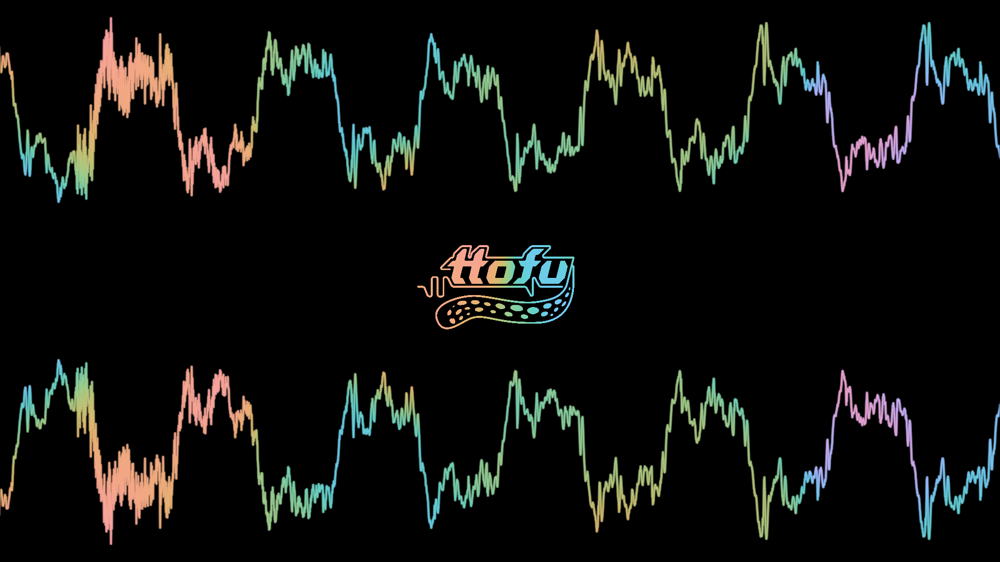

# Lava, a vulkan audio visualizer engine

## Usage
`lava path/to/config.jsonc`
If no path is provided, the default (fullscreen waveform) is loaded.
You can find some example configs in the [examples](./examples) directory